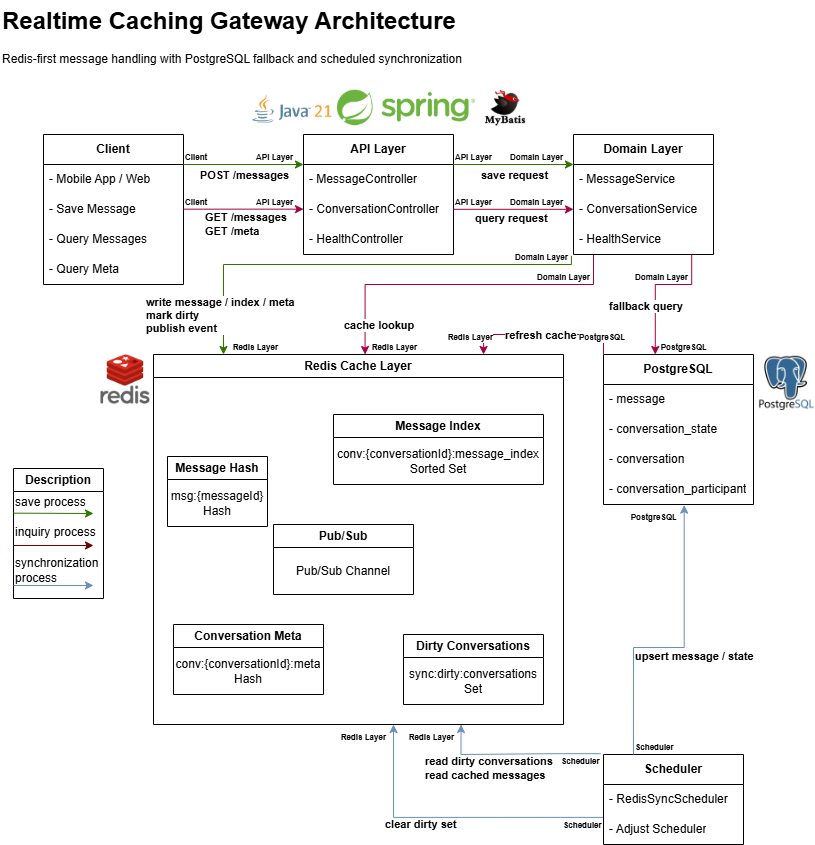
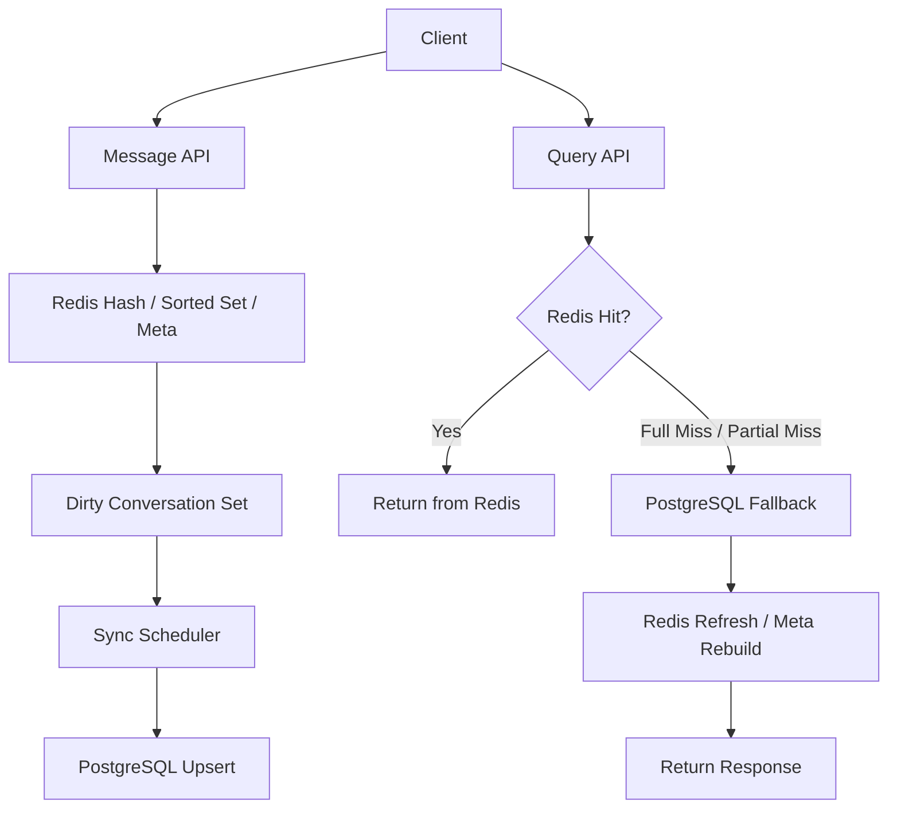

# realtime-caching-gateway

[](https://github.com/Gseobi/realtime-caching-gateway/actions/workflows/ci.yml)

Redis를 단순 Pub/Sub 보조 계층이 아니라 **실시간 메시지 처리 및 캐시 계층**으로 활용하고, PostgreSQL을 **복구 및 최종 영속 계층**으로 분리해 성능, 복구 가능성, 정합성을 함께 고려한 Backend 프로젝트입니다.

</br>

## 1. Quick Proof

- 이 프로젝트는 **캐시 hit 자체보다 miss 이후에도 다시 응답 가능한 구조**를 먼저 설계한 Realtime Caching Gateway입니다.
- **Redis + PostgreSQL fallback + Scheduler sync** 구조로, 조회 성능과 최종 정합성을 함께 가져가는 방향을 보여줍니다.
- **message / conversation meta / dirty conversation** 책임을 분리해, 캐시 유실과 부분 유실이 발생해도 복구 가능한 흐름으로 구성했습니다.

</br>

## 2. Execution Evidence

### Main Flow





### Example Recovery Log

```text
[QueryService] conversationId=room-1001 requested
[Redis] Partial miss detected: messageIds=2 missing
[Fallback] Loading missing messages from PostgreSQL
[Recovery] Redis hash refreshed for missing messages
[Recovery] Conversation meta rebuilt successfully
[Response] Recent messages returned to client
[SyncScheduler] Dirty conversation detected: room-1001
[PostgreSQL] Conversation upsert completed
```

### Example APIs

```http
POST /v1/api/conversations/{conversationId}/messages
GET /v1/api/conversations/{conversationId}/messages
GET /v1/api/conversations/{conversationId}/meta
GET /v1/api/health
```

### What This Proves

- 캐시는 **hit 성능만이 아니라 miss 이후 복구 흐름**까지 포함해 설계해야 합니다.
- Redis를 1차 처리 계층으로 사용하되, PostgreSQL을 **fallback 및 최종 기준 저장소**로 둬 복구 가능성을 확보했습니다.
- dirty conversation 기반 주기 동기화로, 실시간 처리 성능과 최종 정합성 사이의 균형을 맞췄습니다.

</br>

## 3. Problem & Design Goal

실시간 메시지 서비스에서는 최근 조회 성능과 최종 데이터 정합성을 동시에 만족시키는 것이 쉽지 않습니다.

모든 조회를 DB 기준으로 처리하면 최근 대화 조회 비용이 커지고, 반대로 캐시만 신뢰하면 아래와 같은 운영 문제가 생길 수 있습니다.

- Redis full miss 발생 시 메시지 조회 불가
- 일부 메시지만 유실되는 partial miss
- conversation meta 유실로 인한 최신 상태 복구 실패
- Redis와 DB 반영 시점 차이로 인한 정합성 불일치
- 장애 이후 어떤 계층을 기준으로 복구할지 불명확한 구조

그래서 이 프로젝트는 캐시를 단순 성능 보조 계층으로 보지 않고, **빠른 조회를 담당하는 Redis**, **fallback 및 최종 영속을 담당하는 PostgreSQL**, **dirty conversation 기준 동기화를 담당하는 Scheduler**로 책임을 분리해 설계했습니다.

즉, 이 프로젝트는 단순 캐시 예제가 아니라 **조회 성능, 복구 흐름, 최종 정합성**을 함께 설명하기 위한 운영형 메시지 Backend 구조입니다.

</br>

## 4. Key Design

### 1) 메시지 이력과 대화 상태를 분리한 캐시 구조

메시지 이력과 대화방 최신 상태는 조회 목적과 관리 기준이 다르기 때문에 분리했습니다.

- `message`: recent / before / after 조회 중심
- `conversation meta`: 마지막 메시지와 최신 상태 복구 중심
- 구조별로 다른 캐시 정책과 복구 정책 적용 가능

핵심은 메시지 조회 최적화와 상태 복구 책임을 같은 계층에 섞지 않는 것입니다.

### 2) cache hit보다 recovery flow를 포함한 조회 설계

이 프로젝트의 핵심은 캐시 적중 자체보다, **캐시가 깨졌을 때도 다시 응답 가능한 구조**입니다.

- full miss 시 PostgreSQL fallback
- partial miss 시 누락 메시지 복구
- meta miss 시 `conversation_state` 기반 재구성
- 조회 실패를 즉시 서비스 실패로 연결하지 않고 복구 경로로 처리

즉, 운영 중 발생할 수 있는 캐시 불완전 상태를 전제로 설계했습니다.

### 3) dirty conversation 기반 최종 동기화

Redis를 1차 처리 계층으로 활용하되, 최종 영속 반영은 별도 주기 작업으로 분리했습니다.

- 메시지 저장 시 dirty conversation 등록
- Scheduler가 주기적으로 PostgreSQL 반영 수행
- 실시간 처리 성능과 최종 정합성의 균형 확보

이 구조를 통해 write 시점의 응답 속도를 유지하면서도, 장기적으로는 DB를 기준으로 정합성을 맞출 수 있도록 했습니다.

</br>

## 5. Architecture / APIs

### Flow Summary

1. Client가 메시지 저장 요청을 보냅니다.
2. Application은 메시지를 Redis Hash와 Sorted Set에 저장합니다.
3. conversation meta를 갱신하고 dirty conversation을 등록합니다.
4. 조회 요청 시 Redis에서 recent / before / after 메시지를 우선 조회합니다.
5. Redis full miss 또는 partial miss가 발생하면 PostgreSQL fallback을 수행합니다.
6. fallback 결과를 Redis에 refresh 또는 rebuild 합니다.
7. Scheduler가 dirty conversation을 주기적으로 조회해 PostgreSQL에 반영합니다.

### Main APIs

- `GET /v1/api/health`
- `POST /v1/api/conversations/{conversationId}/messages`
- `GET /v1/api/conversations/{conversationId}/messages`
- `GET /v1/api/conversations/{conversationId}/meta`

</br>

## 6. Why These Technologies

- **Java 21 + Spring Boot**: API, Validation, Scheduler, 테스트 구조를 일관되게 설명하기 적합했습니다.
- **Redis**: 최근 메시지 조회, 상태 캐시, dirty tracking을 분리해 관리할 수 있어 실시간 처리 계층으로 적합했습니다.
- **PostgreSQL**: full miss, partial miss, meta 복구 시 기준 저장소이자 최종 영속 계층 역할을 담당합니다.
- **MyBatis**: 조회, fallback, 동기화 흐름을 SQL 중심으로 명확하게 드러내기 위해 선택했습니다.
- **Docker / Docker Compose**: Redis와 PostgreSQL을 함께 올려 복구 시나리오와 동기화 흐름을 반복 검증하기 위해 사용했습니다.

### Tech Stack

- Java 21
- Spring Boot 3.5.11
- Spring Web / Validation / JDBC
- MyBatis
- Redis
- PostgreSQL
- Gradle
- Docker / Docker Compose
- GitHub Actions

</br>

## 7. Test / Exception / Extensibility

### Test Focus

- Health API 동작 확인
- 메시지 저장 API 동작 확인
- recent / before / after 조회 검증
- conversation meta 조회 검증
- Redis full miss fallback 검증
- Redis partial miss recovery 검증
- conversation meta rebuild 검증
- dirty conversation 기반 Redis → PostgreSQL synchronization 검증

### Exception Handling

- **Validation Error**: 잘못된 요청값, 필수값 누락, 잘못된 query parameter 차단
- **Cache Recovery Case**: full miss / partial miss / meta miss를 예외가 아닌 복구 경로로 처리
- **Infrastructure Error**: Redis 또는 PostgreSQL 이상은 Health API와 로그 기준으로 확인 가능
- **Consistency Consideration**: 동기화가 주기 작업 기준이므로, 지연 반영과 복구 시점까지 설계에 포함

### Extensibility

- stale index 정리 로직 추가
- message index TTL 정책 보완
- unread / read pointer 확장
- WebSocket 또는 SSE 기반 실시간 전파 연계
- Flyway 기반 migration 적용
- metrics / tracing / alerting 강화
- 분산 캐시 또는 sharding 전략 확장

핵심은 기능을 많이 넣는 것보다, **변경이 생겨도 구조가 쉽게 무너지지 않도록 만드는 것**입니다.

</br>

## 8. Notes / Blog

### Project Docs

- [Design Notes](docs/design-notes.md)
- [Test Report](docs/test-report.md)
- [Troubleshooting](docs/troubleshooting.md)

### Blog

이 프로젝트의 설계 배경과 캐시 복구 전략은 아래 글에 정리했습니다.

[Redis 캐시는 hit보다 miss 이후 복구 전략이 더 중요하다](https://velog.io/@wsx2386/%EC%BA%90%EC%8B%9C%EB%8A%94-hit%EB%B3%B4%EB%8B%A4-miss-%EC%9D%B4%ED%9B%84-%EB%B3%B5%EA%B5%AC-%EC%A0%84%EB%9E%B5%EC%9D%B4-%EB%8D%94-%EC%A4%91%EC%9A%94%ED%95%98%EB%8B%A4)

Keywords: `Redis Cache`, `PostgreSQL Fallback`, `Partial Miss Recovery`, `Conversation State`, `Scheduled Sync`
