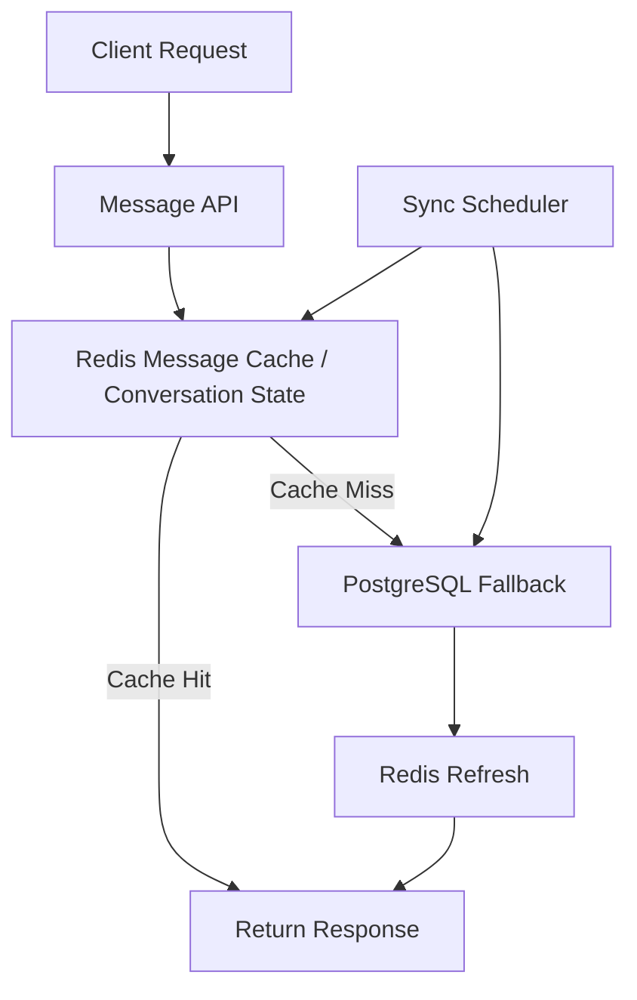
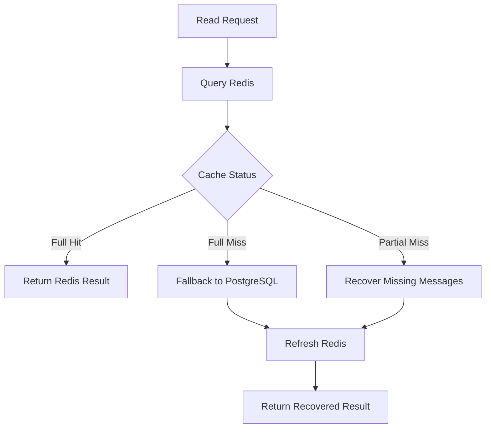

# realtime-caching-gateway

Redis를 단순 Pub/Sub 브로커가 아닌 **real-time message processing layer + cache layer**로 활용하고,  
PostgreSQL을 **fallback and final persistence layer**로 두어  
메시지 데이터의 성능, 복구 가능성, 정합성을 함께 고려한 Realtime Caching Gateway portfolio project입니다.

<br/>

## 1. Project Overview

해당 프로젝트는 실제 업무 중 경험했던 **1:1 상담톡 서비스 리팩토링 설계 경험**을 바탕으로 제작한 포트폴리오 프로젝트입니다.

당시 기존 서비스는 **NestJS, Redis, Docker** 기반으로 운영 중이었고,  
Redis는 주로 **Pub/Sub 기반 이벤트 전달 용도**로만 사용되었으며,  
실시간 메시지와 상태 데이터 처리는 **DB 중심**으로 관리되고 있었습니다.

프로젝트를 파악하는 과정에서 기존 아키텍처 자료가 유실되어 프로젝트 파일만 남아 있었고,  
기존 구조와 데이터 흐름을 먼저 분석해야 했습니다.  
이 과정에서 Redis를 단순 이벤트 전달 계층이 아니라 **message caching and state management layer**로 확장하고,  
DB 부담을 줄이면서도 복구 가능성과 최종 정합성을 유지하는 방향으로 구조를 설계했습니다.

실무에서는 해당 구조에 대한 설계 및 자료 제작까지 완료했지만,  
우선순위 변경으로 실제 개발은 진행되지 못했습니다.

본 프로젝트는 당시 설계 경험을 바탕으로  
message caching / fallback / partial miss handling / scheduled synchronization 구조를  
**Java, Spring Boot, MyBatis, Redis, PostgreSQL** 환경으로 재구성하여 구현한 포트폴리오 프로젝트입니다.

<br/>

## 2. Why This Project

이 프로젝트는 단순한 예제 구현이 아니라,  
실제 운영 중인 메시지성 서비스에서 **캐시 활용 범위**, **복구 가능성**, **최종 정합성**을 함께 고려했던  
리팩토링 설계 경험을 포트폴리오 형태로 정리한 프로젝트입니다.

핵심적으로 아래 문제를 해결하는 구조를 목표로 했습니다.

- Redis를 Pub/Sub broker를 넘어 **message cache and state layer**로 활용
- 최근 메시지와 conversation meta를 Redis에서 우선 조회
- Redis full miss / partial miss 발생 시 PostgreSQL fallback 및 refresh
- dirty conversation 기반 scheduled synchronization
- 캐시 유실 상황에서도 복구 가능한 구조 설계

<br/>

## 3. What This Project Proves

- Redis를 단순 Pub/Sub 보조 계층이 아니라 **message cache / state layer**로 활용할 수 있습니다.
- Redis full miss / partial miss 상황에서도 PostgreSQL fallback 및 refresh를 통해 복구 가능한 구조를 설계할 수 있습니다.
- conversation meta miss 상황에서도 `conversation_state` 기반 복구 흐름을 구성할 수 있습니다.
- Redis와 PostgreSQL의 역할을 분리하여 성능과 최종 정합성을 함께 고려할 수 있습니다.
- dirty conversation 기반 scheduled synchronization으로 최종 반영 구조를 설계할 수 있습니다

<br/>

## 4. Key Design Points

- Redis Hash와 Sorted Set을 활용한 메시지 저장 및 조회 구조
- conversation meta와 message history를 분리한 캐시 설계
- full miss / partial miss 상황을 고려한 fallback and refresh 처리
- dirty conversation 기반 Redis -> PostgreSQL scheduled synchronization
- Redis와 PostgreSQL의 역할 분리를 통한 성능과 복구 가능성 균형

<br/>

## 5. Verified Scenarios

- Redis 기반 메시지 저장
- Redis recent / before / after 조회
- Redis full miss 발생 시 PostgreSQL fallback 및 Redis refresh
- Redis partial miss 발생 시 복구 처리
- conversation meta miss 발생 시 `conversation_state` 기반 복구
- dirty conversation 기반 Redis -> PostgreSQL synchronization
- Redis / PostgreSQL 연결 상태 확인용 Health API 동작

<br/>

## 6. Verification Summary

| Scenario | Expected Behavior | Result | Evidence |
|---|---|---|---|
| Redis insert | 메시지가 Redis 구조에 정상 저장됨 | Pass | `docs/test-report.md` |
| Recent / before / after query | recent / before / after 조회가 정상 동작함 | Pass | `docs/test-report.md` |
| Full cache miss | PostgreSQL fallback 후 Redis refresh 수행 | Pass | `docs/test-report.md` |
| Partial cache miss | 누락 메시지 복구 후 재조회 가능 | Pass | `docs/test-report.md` |
| Conversation meta miss | `conversation_state` 기반 복구 수행 | Pass | `docs/test-report.md` |
| Dirty sync | dirty conversation 기반 PostgreSQL synchronization 수행 | Pass | `docs/test-report.md` |
| Health API | Redis / PostgreSQL 상태 확인 가능 | Pass | `docs/test-report.md` |

<br/>

## 7. Tech Stack

- **Java 21**
- **Spring Boot 3.5.11**
- **MyBatis**
- **Redis**
- **PostgreSQL**
- **Gradle**
- **Docker / Docker Compose**

> 실무 설계 경험에서는 MySQL 기반 서비스를 전제로 구조를 고민했지만,  
> 본 포트폴리오 프로젝트에서는 upsert 및 테스트 편의성을 고려하여 PostgreSQL을 선택했습니다.  
> Docker는 로컬 테스트 환경 구성을 위해 프로젝트 제작과 함께 학습하며 적용했습니다.

<br/>

## 8. Quick Links

- [Test Report](docs/test-report.md)
- [Design Notes](docs/design-notes.md)
- [Troubleshooting Notes](docs/troubleshooting.md)
- [Architecture Diagram](docs/architecture.png)
- Test Log Images: `docs/image/**`

<br/>

## 9. Architecture


### High-Level Flow

1. Client가 메시지 저장 요청을 보냅니다.
2. Application은 메시지를 Redis Hash와 Sorted Set에 저장합니다.
3. Conversation meta를 Redis에 갱신하고 dirty conversation을 등록합니다.
4. 조회 요청 시 Redis에서 recent / before / after 메시지를 우선 조회합니다.
5. Redis full miss 또는 partial miss 발생 시 PostgreSQL fallback을 수행합니다.
6. fallback 결과를 Redis에 refresh 합니다.
7. Scheduler가 dirty conversation을 주기적으로 조회하여 PostgreSQL에 upsert 합니다.



<br/>

## 10. Recovery Flow

Redis 조회는 항상 hit만 전제하지 않고,
full miss / partial miss / meta miss 상황까지 고려하여 복구 가능하도록 설계했습니다.


<br/>

## 11. Redis Data Structures

### `msg:{messageId}`
개별 메시지 데이터를 저장하는 Redis Hash입니다.

예시 필드:
- `messageId`
- `conversationId`
- `senderId`
- `messageType`
- `content`
- `metadataJson`
- `sentAt`

### `conv:{conversationId}:message_index`
conversation별 messageId 목록을 시간 순으로 관리하는 Redis Sorted Set입니다.

- score: `sentAt` 기반 epoch millis
- member: `messageId`

이를 통해 recent / before / after 조회를 효율적으로 처리합니다.

### `conv:{conversationId}:meta`
대화 meta 정보를 저장하는 Redis Hash입니다.

예시 필드:
- `conversationId`
- `lastMessageId`
- `lastMessagePreview`
- `lastSenderId`
- `lastSentAt`
- `updatedAt`

### `sync:dirty:conversations`
주기적 DB 반영이 필요한 conversation을 관리하는 Redis Set입니다.

<br/>

## 12. Database Schema

### `message`
전체 메시지 이력을 저장하는 테이블입니다.

### `conversation_state`
대화방의 마지막 메시지 / 발신자 / 시각 등 meta state를 저장하는 테이블입니다.

### `conversation`
대화방 기본 정보를 저장하는 테이블입니다.

### `conversation_participant`
참여자 정보를 저장하는 테이블입니다.

<br/>

## 13. API

### Health Check
- `GET /v1/api/health`

### Save Message
- `POST /v1/api/conversations/{conversationId}/messages`

### Query Messages
- `GET /v1/api/conversations/{conversationId}/messages?limit=50`
- `GET /v1/api/conversations/{conversationId}/messages?before=...&limit=20`
- `GET /v1/api/conversations/{conversationId}/messages?after=...&limit=20`

### Conversation Meta
- `GET /v1/api/conversations/{conversationId}/meta`
 
<br/>

## 14. Run Locally

### Start Redis / PostgreSQL
```bash
> docker compose up -d
```
### Apply Schema
```bash
> docker exec -i realtime-caching-gateway-postgres \
  psql -U postgres -d realtime_caching_gateway \
  < src/main/resources/db/migration/init_schema_v1.sql
```
### Run Application
- `RealtimeCachingGatewayApplication` 실행
- Active Profile: `local`

<br/>

## 15. Test and Verification
본 프로젝트에서 검증한 주요 시나리오는 다음과 같습니다.
- Redis insert 정상 동작
- Redis recent / before / after query 정상 동작
- Redis full miss 발생 시 PostgreSQL fallback 및 Redis refresh
- Redis partial miss 발생 시 복구 처리
- conversation meta miss 발생 시 `conversation_state` 기반 복구
- dirty conversation 기반 Redis -> PostgreSQL sync

검증 결과, Redis를 단순 캐시가 아니라 real-time message processing layer로 활용하면서도
PostgreSQL fallback 및 주기적 동기화를 통해
복구 가능성과 최종 정합성을 함께 고려한 구조로 동작함을 확인했습니다.

- 상세 테스트 결과는 `docs/test-report.md` 문서를 참고할 수 있습니다.
- 자동화 테스트 실행 결과 예시는 `docs/image/test-report-summary.png`에서 확인할 수 있습니다.

<br/>

## 12. Design Notes

### Why Redis and PostgreSQL
Redis는 빠른 읽기/쓰기와 실시간 처리에 강점이 있고, PostgreSQL은 영속성과 복구 가능성에 강점이 있습니다.
본 프로젝트는 Redis를 1차 처리 계층으로 두고, PostgreSQL을 fallback 및 최종 반영 계층으로 두어
성능과 복구 가능성을 함께 고려한 구조를 목표로 했습니다.

### Why Message and Conversation Separation
메시지 이력 관리와 대화방 상태 관리는 조회 목적과 캐시 정책이 다르기 때문에 분리했습니다.
- `message`: 메시지 단위 데이터와 이력 조회
- `conversation`: 마지막 메시지, 대화 meta, 상태 복구
이를 통해 캐시 정책과 책임을 더 명확하게 나눌 수 있도록 했습니다.

상세한 설계 배경은 아래 문서를 참고할 수 있습니다.
`docs/design-notes.md`

<br/>

## 17. Future Improvements

- stale index 정리 로직 추가
- message index TTL 정책 보완
- unread / read pointer 확장
- WebSocket 기반 실시간 전파 기능 추가
- Flyway 기반 migration 적용
- 운영 메트릭 및 모니터링 확장

<br/>

## 18. Documents

- [Test Report](docs/test-report.md)
- [Design Notes](docs/design-notes.md)
- [Troubleshooting Notes](docs/troubleshooting.md)
- [Architecture Diagram](docs/architecture.png)
- Test Log Images: `docs/image/**`

<br/>

## 19. Conclusion

이 프로젝트는 Redis를 단순 Pub/Sub broker로 사용하는 수준을 넘어,
real-time message processing layer + cache layer로 확장하고,
PostgreSQL을 fallback and final persistence layer로 분리하여
성능, 복구 가능성, 최종 정합성을 함께 고려한 구조를 포트폴리오 형태로 재구성한 결과물입니다.

단순 기능 구현이 아니라,
cache miss 복구, state 기반 처리, scheduled synchronization, 책임 분리를 중심으로
운영형 메시지 백엔드 구조를 설계했다는 점에 의미가 있습니다.
