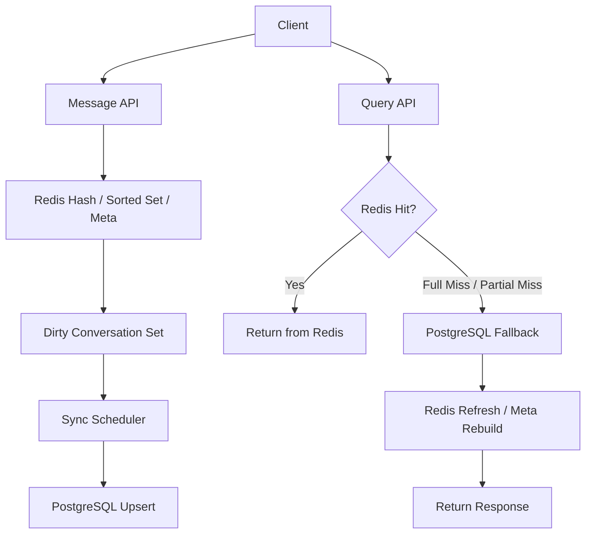

# realtime-caching-gateway

Redis를 단순 Pub/Sub 보조 계층이 아니라 **실시간 메시지 처리 및 캐시 계층**으로 활용하고, 
PostgreSQL을 **복구 및 최종 영속 계층**으로 분리해 성능, 복구 가능성, 정합성을 함께 고려한 Backend 프로젝트입니다.

 

## 1. Overview

이 프로젝트는 실시간 메시지성 서비스에서 최근 메시지 조회 성능을 높이면서도, 캐시 유실이나 부분 유실이 발생했을 때 복구 가능한 구조를 설계하는 데 초점을 둔 **Realtime Caching Gateway** 프로젝트입니다.

단순히 메시지를 저장하고 조회하는 기능 구현보다, 아래와 같은 운영 관점의 문제를 구조로 해결하는 것을 목표로 했습니다.

- 최근 메시지를 빠르게 조회할 수 있는가
- 캐시가 깨졌을 때도 다시 복구해 응답할 수 있는가
- 실시간 처리 성능과 최종 정합성을 함께 가져갈 수 있는가
- 메시지 이력과 대화 상태를 어떤 기준으로 분리할 것인가

 

## 2. Problem This Project Solves

실시간 메시지 서비스에서는 조회 성능과 최종 데이터 정합성을 동시에 만족시키는 것이 쉽지 않습니다.

모든 조회를 DB 기준으로 처리하면 최근 대화 조회 비용이 커지고, 반대로 캐시만 신뢰하면 아래와 같은 운영 문제가 생길 수 있습니다.

- Redis full miss 발생 시 메시지 조회 불가
- index는 남아 있지만 일부 메시지 데이터가 없는 partial miss
- conversation meta 유실로 인한 최신 상태 복구 실패
- Redis와 DB 반영 시점 차이로 인한 정합성 불일치
- 장애 이후 어떤 계층을 기준으로 복구할지 불명확한 구조

이 프로젝트는 이러한 문제를 다음과 같이 풀어냅니다.

- **Redis**: 빠른 읽기/쓰기와 최근 메시지 조회 담당
- **PostgreSQL**: fallback 및 최종 영속 계층 담당
- **Scheduler**: dirty conversation 기준 주기적 동기화 담당

즉, 이 프로젝트는 단순 캐시 예제가 아니라 **조회 성능, 복구 흐름, 최종 정합성**을 함께 설계한 운영형 메시지 Backend 구조를 설명하기 위한 프로젝트입니다.

 

## 3. Key Design Points

### 1) 메시지 이력과 대화 상태를 분리한 캐시 구조

메시지 이력과 대화방 최신 상태는 조회 목적과 관리 기준이 다르기 때문에 분리했습니다.

- `message`: recent / before / after 조회 중심
- `conversation meta`: 마지막 메시지와 최신 상태 복구 중심
- 구조별로 다른 캐시 정책과 복구 정책 적용 가능

이렇게 분리하면 메시지 조회 최적화와 상태 복구 책임을 명확하게 나눌 수 있습니다.

### 2) cache hit만이 아니라 recovery flow까지 포함한 조회 설계

이 프로젝트의 핵심은 캐시 적중 자체보다, **캐시가 깨졌을 때도 다시 응답 가능한 구조**입니다.

- full miss 시 PostgreSQL fallback
- partial miss 시 누락 메시지 복구
- meta miss 시 `conversation_state` 기반 재구성
- 조회 실패를 즉시 서비스 실패로 연결하지 않고 복구 경로로 처리

즉, 운영 중 발생할 수 있는 캐시 불완전 상태를 전제로 설계했습니다.

### 3) dirty conversation 기반 최종 동기화

Redis를 1차 처리 계층으로 활용하되, 최종 영속 반영은 별도 주기 작업으로 분리했습니다.

- 메시지 저장 시 dirty conversation 등록
- Scheduler가 주기적으로 PostgreSQL 반영 수행
- 실시간 처리 성능과 최종 정합성의 균형 확보

이 구조를 통해 write 시점의 응답 속도를 유지하면서도, 장기적으로는 DB를 기준으로 정합성을 맞출 수 있도록 했습니다.

 

## 4. Architecture / Flow

### Flow Summary

1. Client가 메시지 저장 요청을 보냅니다.
2. Application은 메시지를 Redis Hash와 Sorted Set에 저장합니다.
3. conversation meta를 갱신하고 dirty conversation을 등록합니다.
4. 조회 요청 시 Redis에서 recent / before / after 메시지를 우선 조회합니다.
5. Redis full miss 또는 partial miss가 발생하면 PostgreSQL fallback을 수행합니다.
6. fallback 결과를 Redis에 refresh 또는 rebuild 합니다.
7. Scheduler가 dirty conversation을 주기적으로 조회해 PostgreSQL에 반영합니다.

### High-Level Flow

### Main APIs

- `GET /v1/api/health`
- `POST /v1/api/conversations/{conversationId}/messages`
- `GET /v1/api/conversations/{conversationId}/messages`
- `GET /v1/api/conversations/{conversationId}/meta`

 

## 5. Why These Technologies

### Java 21 + Spring Boot

API, Validation, Scheduler, 테스트 구조를 일관되게 구성하기 적합하다고 판단했습니다.  
계층별 책임 분리와 운영형 흐름을 설명하기에도 적절한 기본 골격을 제공합니다.

### Redis

최근 메시지 조회와 상태 캐시에 유리합니다.  
Hash / Sorted Set / Set 조합으로 메시지 데이터, index, dirty tracking을 구분해 관리할 수 있어 **실시간 처리 계층**으로 활용하기에 적합했습니다.

### PostgreSQL

최종 영속성과 fallback 기준 저장소 역할을 담당합니다.  
full miss, partial miss, meta 복구 시 기준 계층이 되며, 로컬 테스트와 upsert 검증에도 적합했습니다.

### MyBatis

메시지 조회, fallback, 동기화 흐름을 SQL 중심으로 명확하게 드러내기 위해 선택했습니다.  
복구 흐름을 설명할 때도 조회/저장 의도를 비교적 분명하게 표현할 수 있습니다.

### Docker / Docker Compose

Redis와 PostgreSQL을 함께 검증하는 로컬 환경을 반복적으로 구성하기 위해 사용했습니다.  
복구 시나리오와 동기화 흐름을 재현하기에 유용했습니다.

### Tech Stack

- Java 21
- Spring Boot 3.5.11
- Spring Web / Validation / JDBC
- MyBatis
- Redis
- PostgreSQL
- Gradle
- Docker / Docker Compose

 

## 6. Test / CI / Exception Handling

### Test Focus

이 프로젝트는 단순 happy path 확인보다 **운영 중 실제로 문제가 될 수 있는 복구 흐름** 검증에 더 집중했습니다.

- Health API 동작 확인
- 메시지 저장 API 동작 확인
- recent / before / after 조회 검증
- conversation meta 조회 검증
- Redis full miss fallback 검증
- Redis partial miss recovery 검증
- conversation meta rebuild 검증
- dirty conversation 기반 Redis → PostgreSQL synchronization 검증

### CI

- GitHub Actions 기반 build / test 자동화
- 핵심 조회 및 복구 흐름에 대한 회귀 확인 가능
- README 배지로 기본 상태를 바로 확인 가능

### Exception Handling

- **Validation Error**
  - 잘못된 요청값, 필수값 누락, 잘못된 query parameter 차단
- **Cache Recovery Case**
  - full miss / partial miss / meta miss를 예외가 아닌 복구 경로로 처리
- **Infrastructure Error**
  - Redis 또는 PostgreSQL 이상은 Health API와 로그 기준으로 확인 가능
- **Consistency Consideration**
  - 동기화가 주기 작업 기준이므로, 지연 반영과 복구 시점까지 설계에 포함

 

## 7. Extensibility

이 구조는 현재 기능 구현만이 아니라 이후 운영 확장을 고려해 설계했습니다.

- stale index 정리 로직 추가
- message index TTL 정책 보완
- unread / read pointer 확장
- WebSocket 또는 SSE 기반 실시간 전파 연계
- Flyway 기반 migration 적용
- metrics / tracing / alerting 강화
- 분산 캐시 또는 sharding 전략 확장

핵심은 기능을 많이 넣는 것보다, **변경이 생겨도 구조가 쉽게 무너지지 않도록 만드는 것**입니다.

 

## 8. Notes / Blog

### Project Docs

- [Design Notes](docs/design-notes.md)
- [Test Report](docs/test-report.md)
- [Troubleshooting](docs/troubleshooting.md)

### Blog

이 프로젝트의 설계 배경과 캐시 복구 전략은 아래 글에 정리했습니다.

[Redis 캐시는 hit보다 miss 이후 복구 전략이 더 중요하다](https://velog.io/@wsx2386/%EC%BA%90%EC%8B%9C%EB%8A%94-hit%EB%B3%B4%EB%8B%A4-miss-%EC%9D%B4%ED%9B%84-%EB%B3%B5%EA%B5%AC-%EC%A0%84%EB%9E%B5%EC%9D%B4-%EB%8D%94-%EC%A4%91%EC%9A%94%ED%95%98%EB%8B%A4)

Keywords: `Redis Cache`, `PostgreSQL Fallback`, `Partial Miss Recovery`, `Conversation State`, `Scheduled Sync`
