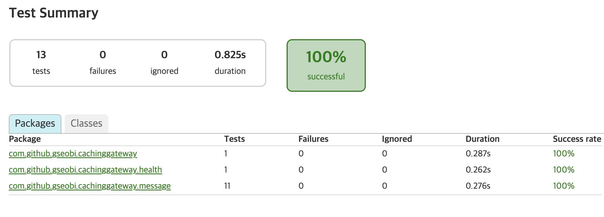
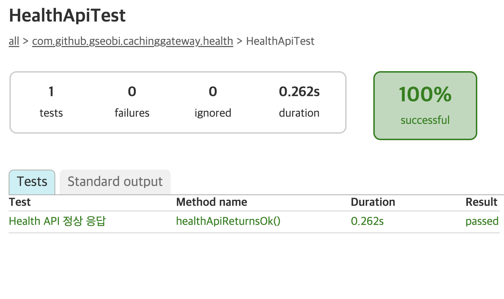
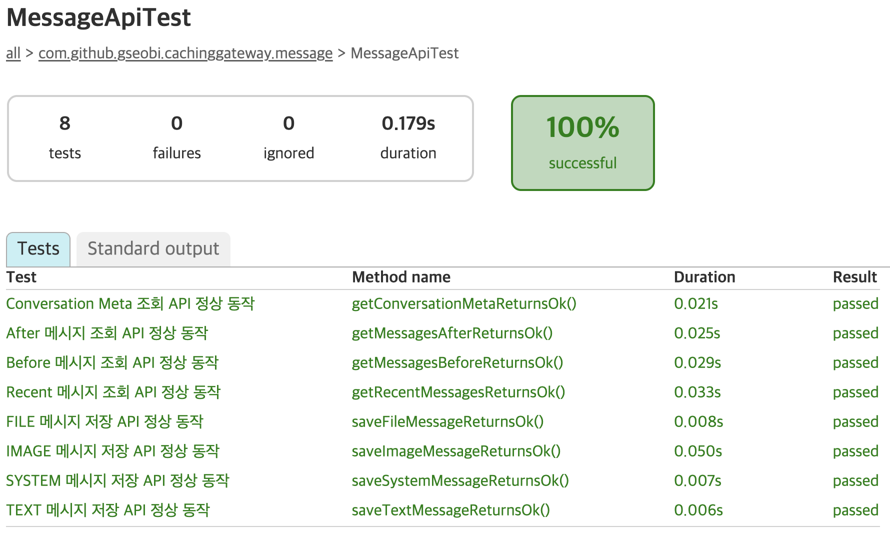
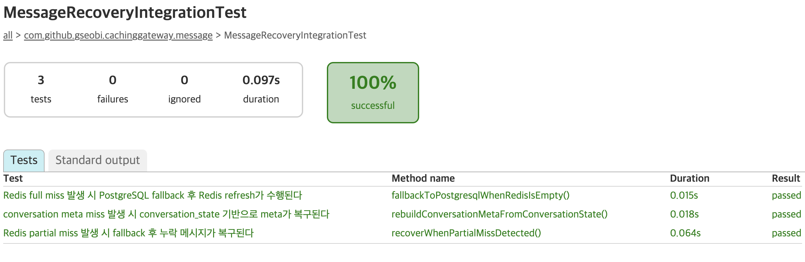

# Test Report

## 1. Overview

본 문서는 `realtime-caching-gateway` 프로젝트에서 검증한 주요 시나리오를 정리한 문서입니다.  
Redis를 **real-time message processing layer + cache layer**로 활용하고, PostgreSQL을 **fallback / final persistence layer**로 두는 구조가  
의도한 흐름대로 동작하는지 확인하는 데 목적이 있습니다.

본 프로젝트의 검증은 아래 두 방식으로 수행했습니다.

- **자동화 테스트**
    - Spring Boot Test / MockMvc 기반 API 통합 테스트
    - test profile 기준 애플리케이션 컨텍스트 부팅 검증
- **수동 / 통합 검증**
    - 로컬 Redis / PostgreSQL 환경에서 fallback, recovery, synchronization 시나리오 확인

 

## 2. Test Environment

### Application / Runtime
- Java 21
- Spring Boot 3.5.11
- Gradle

### Infrastructure
- Redis
- PostgreSQL
- Docker / Docker Compose

### Test Profile
- `test` profile 사용
- Redis Pub/Sub listener 비활성화 후 컨텍스트 로딩 검증
- MockMvc 기반 API 테스트 수행

 

## 3. Automated Test Coverage

### 3.1 Application Context Load
**Test Class**
- `RealtimeCachingGatewayApplicationTests`

**Purpose**
- test profile 기준으로 애플리케이션 컨텍스트가 정상적으로 로딩되는지 확인

**Verified**
- Redis Pub/Sub listener 비활성화 상태에서 Spring Boot context load 성공

**Result**
- Pass

 

### 3.2 Health API
**Test Class**
- `HealthApiTest`

**Scenario**
- `GET /v1/api/health`

**Purpose**
- Redis / PostgreSQL 연결 상태 확인용 Health API가 정상 응답하는지 검증

**Expected**
- Health API 정상 응답
- 상태 확인 가능

**Result**
- Pass

 

### 3.3 Message Save API
**Test Class**
- `MessageApiTest`

**Scenarios**
- TEXT 메시지 저장
- IMAGE 메시지 저장
- FILE 메시지 저장
- SYSTEM 메시지 저장

**API**
- `POST /v1/api/conversations/{conversationId}/messages`

**Purpose**
- 다양한 메시지 타입에 대해 저장 API가 정상 동작하는지 검증

**Expected**
- 요청이 정상 처리됨
- 메시지 저장 흐름이 정상 수행됨

**Result**
- Pass

 

### 3.4 Message Query API
**Test Class**
- `MessageApiTest`

**Scenarios**
- Recent 메시지 조회
- Before 메시지 조회
- After 메시지 조회

**API**
- `GET /v1/api/conversations/{conversationId}/messages`

**Purpose**
- recent / before / after 기준 조회 API가 정상 동작하는지 검증

**Expected**
- 조회 요청이 정상 처리됨
- 조건에 맞는 메시지 조회 흐름이 정상 수행됨

**Result**
- Pass

 

### 3.5 Conversation Meta API
**Test Class**
- `MessageApiTest`

**Scenario**
- Conversation Meta 조회

**API**
- `GET /v1/api/conversations/{conversationId}/meta`

**Purpose**
- conversation meta 조회 API가 정상 동작하는지 검증

**Expected**
- meta 조회 요청이 정상 처리됨
- conversation meta 반환 가능

**Result**
- Pass

 

### 3.6 Recovery / Fallback Integration
**Test Class**
- `MessageRecoveryIntegrationTest`

**Scenarios**
- Redis full miss fallback
- Redis partial miss recovery
- conversation meta recovery

**Purpose**
- Redis miss / partial miss / meta miss 상황에서 PostgreSQL fallback 및 Redis refresh / rebuild 흐름이 정상 동작하는지 검증

**Expected**
- full miss 발생 시 PostgreSQL fallback 후 메시지 조회 가능
- partial miss 발생 시 누락 message hash 복구
- meta miss 발생 시 `conversation_state` 기반 meta 재구성

**Result**
- Pass

 

## 4. Manual / Integration Verification Scenarios

### 4.1 Message Save to Redis
**Scenario**  
메시지 저장 요청 시 Redis Hash, Sorted Set, conversation meta, dirty conversation set이 정상 반영되는지 확인

**Expected**
- `msg:{messageId}` 생성
- `conv:{conversationId}:message_index` 반영
- `conv:{conversationId}:meta` 갱신
- `sync:dirty:conversations` 등록
- Pub/Sub 이벤트 발행

**Result**
- 정상 동작 확인

 

### 4.2 Recent Message Query from Redis
**Scenario**  
최근 메시지 조회 요청 시 Redis Sorted Set 역순 조회 기반으로 메시지 목록이 반환되는지 확인

**Expected**
- Redis hit 시 DB 조회 없이 응답
- 최근 순서 기준 메시지 반환

**Result**
- 정상 동작 확인

 

### 4.3 Before / After Query from Redis
**Scenario**  
before / after 조건 조회 시 score range 기반으로 메시지가 조회되는지 확인

**Expected**
- 조건에 맞는 메시지 목록 반환
- Redis hit 시 DB fallback 없이 응답

**Result**
- 정상 동작 확인

 

### 4.4 Full Miss Fallback
**Scenario**  
Redis cache가 비어 있는 상태에서 메시지 조회 요청 시 PostgreSQL fallback 및 Redis refresh가 수행되는지 확인

**Expected**
- PostgreSQL에서 데이터 조회
- Redis cache 재구성
- 이후 동일 요청 시 Redis hit 가능

**Result**
- 정상 동작 확인

 

### 4.5 Partial Miss Recovery
**Scenario**  
Redis index는 존재하지만 일부 message hash가 유실된 경우 partial miss를 감지하고 복구하는지 확인

**Expected**
- partial miss 감지
- PostgreSQL fallback 수행
- Redis refresh 후 응답 정상화

**Result**
- 정상 동작 확인

 

### 4.6 Conversation Meta Recovery
**Scenario**  
conversation meta가 유실된 경우 `conversation_state` 기반으로 meta 복구가 가능한지 확인

**Expected**
- PostgreSQL `conversation_state` 조회
- Redis meta 재구성
- 이후 meta 조회 정상 동작

**Result**
- 정상 동작 확인

 

### 4.7 Redis -> PostgreSQL Scheduled Sync
**Scenario**  
dirty conversation 기반 scheduler 동작 시 Redis 상태가 PostgreSQL에 반영되는지 확인

**Expected**
- dirty conversation 조회
- `message`, `conversation_state` upsert 수행
- 동기화 후 상태 일관성 유지

**Result**
- 정상 동작 확인

 

## 5. Summary

본 프로젝트에서는 아래 항목을 검증했습니다.

### Automated Tests
- test profile 기준 애플리케이션 컨텍스트 로딩
- Health API 정상 응답
- 메시지 저장 API 정상 동작
- recent / before / after 조회 API 정상 동작
- conversation meta 조회 API 정상 동작
- full miss fallback / partial miss recovery / meta recovery 자동화 테스트

### Manual / Integration Verification
- Redis 기반 메시지 저장 및 조회
- full miss / partial miss 상황에서 PostgreSQL fallback 및 Redis refresh
- conversation meta recovery
- scheduled synchronization

이를 통해 Redis를 단순 캐시가 아니라 **real-time message processing layer + cache layer**로 활용하면서도,  
PostgreSQL fallback과 주기적 synchronization을 통해  
복구 가능성과 최종 정합성을 함께 고려한 구조가 동작함을 확인했습니다.

 

## 6. Notes

- 자동화 테스트는 `src/test/java/**` 경로의 Spring Boot Test / MockMvc 기반 테스트 코드로 구성
- 상세 실행 로그 및 스크린샷은 `docs/image/**` 참고
- fallback / recovery / synchronization 시나리오는 로컬 환경 기준 수동 / 통합 테스트로 검증

 

## 7. Automated Test Report Snapshot

